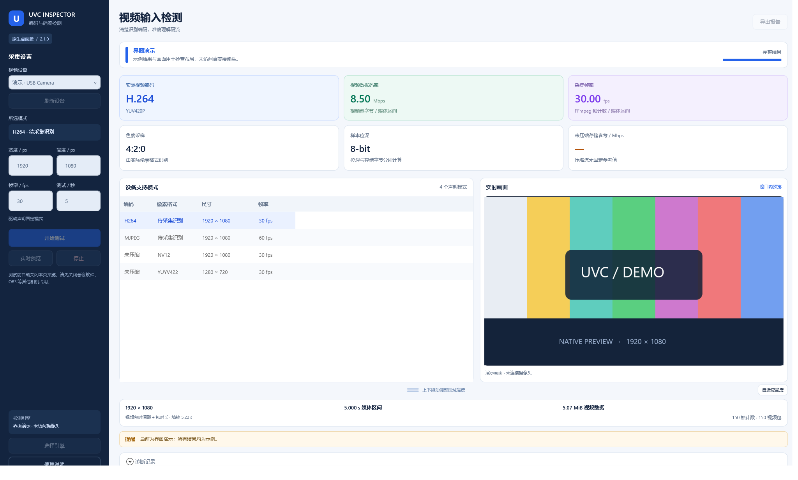

# UVC Inspector · 编码与码流检测

[](https://github.com/cz15909681360-create/uvc-inspector/actions/workflows/build.yml)
[](LICENSE)

**Native Windows camera codec and bitrate inspector, built with C# / WPF and FFmpeg.**

Windows 原生桌面检测工具。2.0 版使用 C# / WPF 重建，直接在窗口内完成设备枚举、模式选择、视频码流测试与预览。运行时不启动浏览器，不启动 HTTP 服务，不占用网页端口。



上图为演示模式，不是真实摄像头测量。窗口内显示设备模式、实际编码、像素格式、码率、帧率与诊断；预览区域高度支持拖动调整。

## 下载与环境

- 系统：Windows 10 / 11 x64。
- 下载：[最新发行版](https://github.com/cz15909681360-create/uvc-inspector/releases/latest)。
- 采集引擎：2.1.0 起主 EXE 内置 FFmpeg 8.1.3，无需另外安装。首次使用自动解出经过 SHA-256 校验的引擎，之后复用缓存。
- 源码开发需要 .NET 10 SDK；下载的 Windows 自包含程序不需要另外安装 .NET。

没有相机的机器可以先检查界面：`UvcInspector.exe --demo`。演示模式不访问相机，禁用真实采集与报告导出。

## 使用

解压完整的 `UvcInspector-v2.1.0-win-x64.zip`，双击 `UvcInspector.exe`。主程序包含 .NET 运行时和 FFmpeg，不需要安装 Python、.NET 或 FFmpeg。`licenses/ffmpeg` 提供内置引擎的源码归档、LGPL 许可证、构建命令与工具链记录。

1. 点击“刷新设备”，选择视频源。
2. 在“设备支持模式”中选择一行。编码、像素格式、尺寸、帧率分别列出；驱动的尺寸范围完整保留。
3. 设置测试时长，范围为 2–120 秒。固定尺寸模式默认选取声明的最高帧率；可变尺寸模式默认选取最小端点，不假定整个范围内所有组合都可用。
4. 点击“开始测试”。程序先停止自己的预览，再复制原视频包并统计字节与时间戳，不重新编码视频、不采集音频、不保存相机画面。
5. 查看实际编码、像素格式、码率、帧率、色度与位深。失败或取消时保留诊断数据，不显示为成功。
6. 如需观察画面，点击“实时预览”。预览会解码、缩放成窗口内图像；它不参与测试码率。停止或关闭窗口会终止本程序的采集进程。
7. 点击“导出报告”，保存 JSON 完整记录或 CSV 汇总。

模式列表与实时画面默认随窗口高度增大。上下拖动这两个区域底部的手柄可同时调整高度，手动高度会保存供下次使用；点击“自适应高度”恢复随窗口调整。手柄也支持键盘方向键（20 px）、PageUp/PageDown（100 px），Home 恢复自适应。画面保持比例，区域超过窗口高度时可滚动页面。

默认使用内置引擎，支持 RAW、MJPEG、H.264、HEVC 的检测及解码预览。内置构建没有 libx264/libx265 编码器，本软件测试复制原视频包，并不需要它们。需要额外格式时，可点击“选择引擎”指定兼容 DirectShow 的外部 `ffmpeg.exe`；已明确指定且存在的路径优先于内置引擎。

内置引擎缓存位于 `%LOCALAPPDATA%\UvcInspector\engines`，按完整 SHA-256 分目录。启动会校验缓存；损坏的缓存自动从 EXE 修复。缓存被删除后，下次启动自动重建，无需联网。

设置和意外错误记录位于 `%LOCALAPPDATA%\UvcInspector`。关闭会议软件、OBS 等其他相机占用后再测试。设备切换、刷新、预览、测试相互协调，窗口关闭后没有后台网页服务残留。

## 结果含义

- **实际视频编码**：例如 RAW、MJPEG、H.264、HEVC；像素格式独立显示，例如 NV12、YUV420P。
- **视频数据码率**：原视频包有效字节数 × 8 ÷ 观测媒体区间。不会把 framecrc 输出文本大小当作视频量。
- **采集帧率**：FFmpeg 采集帧计数 ÷ 媒体区间。视频包计数独立列出；压缩包不解码，不能等同于对画面完整性的逐帧验证。
- **未压缩存储参考**：根据实际 RAW 像素格式的存储布局、尺寸和标称帧率计算。P010 的 10-bit 样本按 16-bit 存储字计算；布局未知时保留未知。压缩流没有固定参考值。
- **媒体区间**：优先使用视频包时间戳与包时长，排除时间戳原点偏移；末包时长缺失时明确标记间隔估算；时间戳不足时可使用 FFmpeg 媒体进度。不会用填写的测试秒数代替实测时间。

这些值属于采集端有效视频数据，**不包含 USB 协议开销，不是 USB 总线总占用测量，也不能单独确定硬件掉帧原因**。DirectShow 列表可能包含虚拟相机；程序尚未单独验证视频源的 USB/UVC 身份。

配色使用蓝色表示编码与采集状态、绿色表示码率及完成、紫色表示帧率、琥珀色表示提醒/取消、红色表示失败。所有状态同时有文字；窗口缩小时可以滚动内容。

## 构建与验证

源码需要 Windows 和 .NET 10 SDK。脚本优先使用项目 `.tools`、上级工作区 `.tools` 或 PATH 中的 SDK；不会自动安装系统组件。

```powershell
./build.ps1 -Test
./build.ps1 -Integration
./build.ps1 -Package
```

旧的完整集成检查需 PATH 中带 libx264/libx265 编码器的 FFmpeg，使用临时生成视频验证 RAW/MJPEG/H.264/HEVC 测量、取消、超时与 MJPEG 图像流，不自动打开真实相机。内置引擎有独立的提取/校验、四种格式的复制测量与 JPEG 预览、进程取消检查，见开发指南。单独的本机硬件检查为：

```powershell
dotnet run --project tests/UvcInspector.Tests -c Release -- --integration --hardware
```

硬件检查当前明确使用名为 `FHD Camera` 的本机验证设备。硬件型号变更后需调整该测试夹具；不把缺少特定硬件当作其他机器的软件缺陷。

界面截图使用真实 WPF 布局和带标记的演示数据，不访问摄像头：

```powershell
UvcInspector.exe --demo --capture ui.png
UvcInspector.exe --demo --empty --capture ui-empty.png --width 1040 --height 720
UvcInspector.exe --demo --error-demo --capture ui-error.png
UvcInspector.exe --demo --capture ui-large.png --width 2048 --height 1232 --layout-check
```

截图时同时写出 `.bindings.txt`；发生 WPF 数据绑定错误时退出码为 2。普通运行无需任何参数。

`--layout-check` 通过实际 WPF 拖动/按钮事件检查区域增高、预览同步增高、窗口缩放、自适应恢复及高度上下限，生成 `.layout.json`；检查失败时退出码为 4。演示与截图不会改写用户的高度设置。

源码分为独立检测核心、WPF 界面、测试程序；构建产物和本机硬件日志在 `artifacts` 下，不应提交到源码仓库。

| 文档 | 内容 |
| --- | --- |
| [架构与统计约定](docs/ARCHITECTURE.md) | 模块职责、测量公式、进程释放与边界 |
| [开发与发布](docs/DEVELOPMENT.md) | 克隆、构建、验证、自包含打包和 CI |
| [常见问题](docs/TROUBLESHOOTING.md) | 找不到引擎、设备占用、低帧率和预览调整 |
| [验证记录](VERIFICATION.md) | 已验证内容与尚未覆盖的条件 |
| [更新记录](CHANGELOG.md) | 原生版改进历史 |
| [贡献指南](CONTRIBUTING.md) | 问题报告、代码修改和检查要求 |
| [安全问题](SECURITY.md) | 漏洞报告及日志隐私 |

## 发布说明

本仓库发布原生桌面版的独立工程；旧网页版本和原 EXE 不在此仓库中。源码采用 [MIT 许可证](LICENSE)，授权范围说明见 [LICENSE-STATUS.md](LICENSE-STATUS.md)；第三方组件说明见 [THIRD-PARTY-NOTICES.md](THIRD-PARTY-NOTICES.md)。
